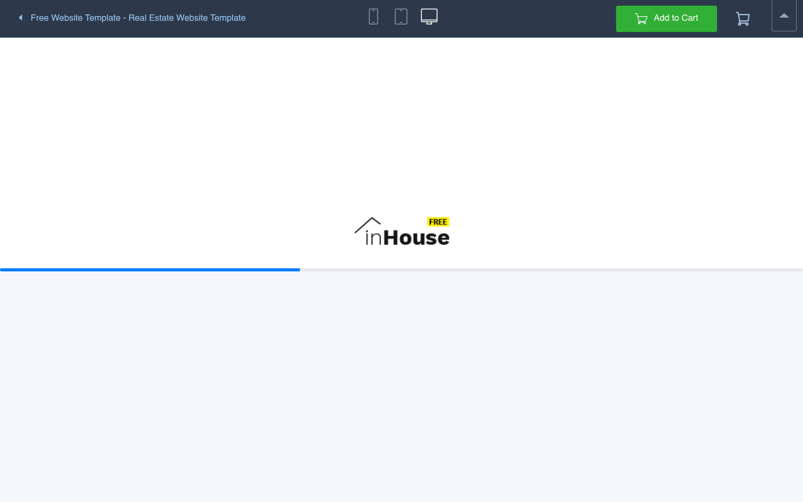
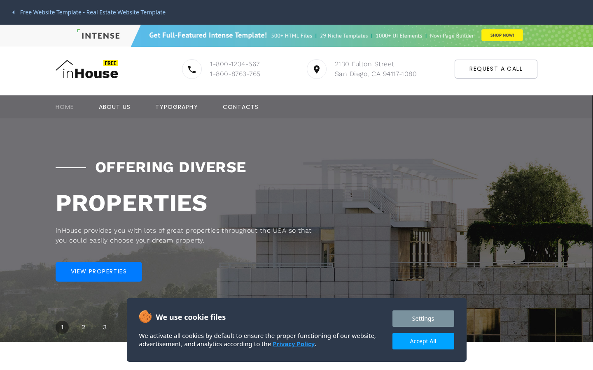
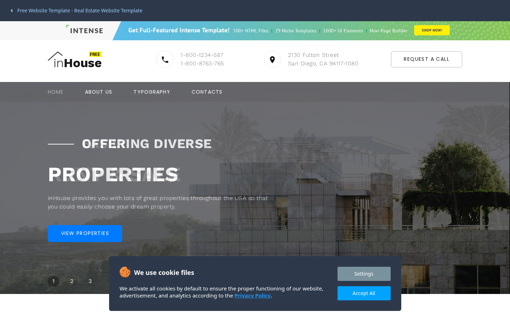
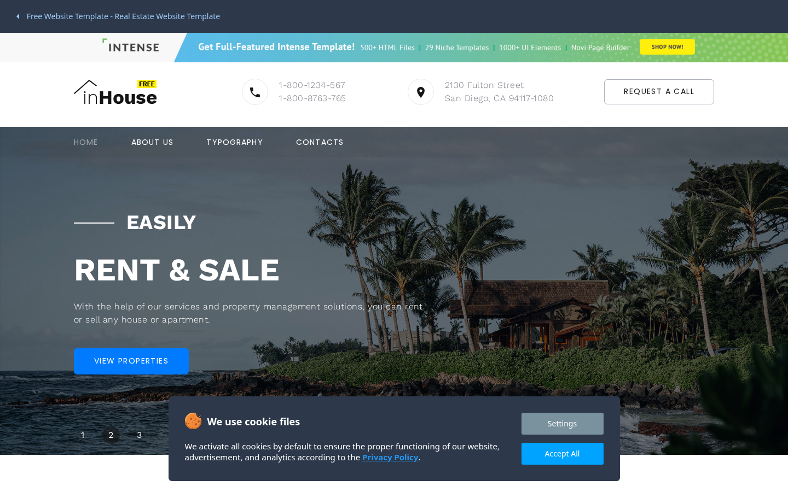
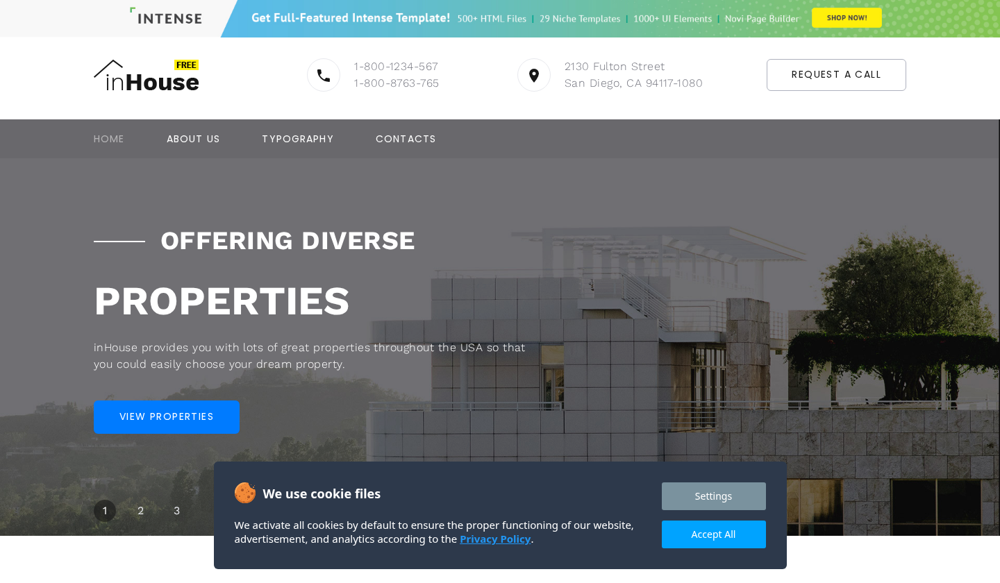
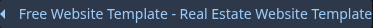

# demo Design System

You are building UI for **demo**. Light-themed, cool palette, sans-serif typography (sans-serif), standard density on a 5px grid, flat elevation (no shadows).

## Visual Reference

**IMPORTANT**: Study ALL screenshots below before writing any UI. Match colors, typography, spacing, layout, and motion exactly as shown.

### Homepage



### Scroll Journey (Cinematic Visual States)

> These screenshots capture the website at different scroll depths. The design changes dramatically as you scroll — each frame shows a different cinematic state. Replicate these exact visual transitions.

#### 0% — Hero / Above the fold



#### 17% — Mid-page at 17% scroll


#### 33% — Mid-page at 33% scroll



#### 50% — Mid-page at 50% scroll


#### 67% — Mid-page at 67% scroll



#### 83% — Mid-page at 83% scroll


#### 100% — Footer / End of page


> Read `references/DESIGN.md` for full token details. Read `references/ANIMATIONS.md` for motion specs. Read `references/LAYOUT.md` for layout structure. Read `references/COMPONENTS.md` for component patterns.

## Ultra Reference Files

This package includes extended documentation. **Read these files before implementing:**

| File | Contents |
|------|----------|
| `references/DESIGN.md` | Full design system tokens, colors, typography, spacing |
| `references/VISUAL_GUIDE.md` | **START HERE** — Master visual guide with all screenshots embedded |
| `references/ANIMATIONS.md` | CSS keyframes, scroll triggers, motion library stack, video specs |
| `references/LAYOUT.md` | Flex/grid containers, page structure, spacing relationships |
| `references/COMPONENTS.md` | DOM component patterns, HTML structure, class fingerprints |
| `references/INTERACTIONS.md` | Hover/focus states with before/after style diffs |
| `screens/scroll/` | 7 scroll journey screenshots showing cinematic states |

## Design Philosophy

- **Solid colors only** — no gradients anywhere. Every surface is a single flat color.
- **Single typeface** — sans-serif carries all text. Hierarchy comes from size, weight, and color — never font mixing.
- **standard density** — 5px base grid. Every dimension is a multiple of 5.
- **cool palette** — the color temperature runs cool, matching the sans-serif typography.
- **Restrained accent** — `#00a3ff` is the only pop of color. Used exclusively for CTAs, links, focus rings, and active states.
- **Minimal motion** — prefer instant state changes. Only use transitions for loading and page transitions.

## Color System

### Core Palette

| Role | Token | Hex | Use |
|------|-------|-----|-----|
| Background | `--background` | `#ffffff` | Page/app background |
| Surface | `--surface` | `#b3c8e7` | Cards, panels, modals |
| Text Primary | `--text-primary` | `#243238` | Headings, body text |
| Text Muted | `--text-muted` | `#b0bec5` | Captions, placeholders |
| Accent | `--accent` | `#00a3ff` | CTAs, links, focus rings |

### Status Colors

| Status | Hex | Use |
|--------|-----|-----|
| Danger | `#da532c` | Errors, destructive actions |

### Extended Palette

- `#9cc8f5`
- `#2d394b`
- **theme-color:** `#2196f3`
- `#000000` — Deep background layer or shadow color

## Typography

### Font Stack

- **sans-serif** — Heading 1, Heading 2, Heading 3, Body, Caption

### Type Scale

| Role | Family | Size | Weight |
|------|--------|------|--------|
| Heading 1 | sans-serif | 48px / 3rem | 700 |
| Heading 2 | sans-serif | 32px / 2rem | 600 |
| Heading 3 | sans-serif | 24px / 1.5rem | 600 |
| Body | sans-serif | 16px / 1rem | 400 |
| Caption | sans-serif | 12px / 0.75rem | 400 |

### Typography Rules

- All text uses **sans-serif** — never add another font family
- Max 3-4 font sizes per screen
- Headings: weight 600-700, body: weight 400
- Use color and opacity for text hierarchy, not additional font sizes
- Line height: 1.5 for body, 1.2 for headings

## Spacing & Layout

### Base Grid: 5px

Every dimension (margin, padding, gap, width, height) must be a multiple of **5px**.

### Spacing Scale

`10, 15, 20, 30, 70` px

### Spacing as Meaning

| Spacing | Use |
|---------|-----|
| 2.5-5px | Tight: related items within a group |
| 10px | Medium: between groups |
| 15-20px | Wide: between sections |
| 30px+ | Vast: major section breaks |

### Border Radius

Scale: `3px`
Default: `3px`

### Breakpoints

| Name | Value |
|------|-------|
| md | 679px |
| md | 719px |
| lg | 959px |
| 2xl | 1649px |

Mobile-first: design for small screens, layer on responsive overrides.

## Component Patterns

### Card

```css
.card {
  background: #b3c8e7;
  border-radius: 3px;
  padding: 20px;
}
```

```html
<div class="card">
  <h3>Card Title</h3>
  <p>Card content goes here.</p>
</div>
```

### Button

```css
/* Primary */
.btn-primary {
  background: #00a3ff;
  color: #243238;
  border-radius: 3px;
  padding: 10px 20px;
  font-weight: 500;
  transition: opacity 150ms ease;
}
.btn-primary:hover { opacity: 0.9; }

/* Ghost */
.btn-ghost {
  background: transparent;
  border: 1px solid #cccccc;
  color: #243238;
  border-radius: 3px;
  padding: 10px 20px;
}
```

```html
<button class="btn-primary">Get Started</button>
<button class="btn-ghost">Learn More</button>
```

### Input

```css
.input {
  background: #ffffff;
  border: 1px solid #cccccc;
  border-radius: 3px;
  padding: 10px 15px;
  color: #243238;
  font-size: 14px;
}
.input:focus { border-color: #00a3ff; outline: none; }
```

```html
<input class="input" type="text" placeholder="Search..." />
```

### Badge / Chip

```css
.badge {
  display: inline-flex;
  align-items: center;
  padding: 10px 10px;
  border-radius: 9999px;
  font-size: 12px;
  font-weight: 500;
  background: #b3c8e7;
  color: #b0bec5;
}
```

```html
<span class="badge">New</span>
<span class="badge">Beta</span>
```

### Modal / Dialog

```css
.modal-backdrop { background: rgba(0, 0, 0, 0.6); }
.modal {
  background: #b3c8e7;
  border-radius: 3px;
  padding: 30px;
  max-width: 480px;
  width: 90vw;
}
```

```html
<div class="modal-backdrop">
  <div class="modal">
    <h2>Dialog Title</h2>
    <p>Dialog content.</p>
    <button class="btn-primary">Confirm</button>
    <button class="btn-ghost">Cancel</button>
  </div>
</div>
```

### Table

```css
.table { width: 100%; border-collapse: collapse; }
.table th {
  text-align: left;
  padding: 10px 15px;
  font-weight: 500;
  font-size: 12px;
  color: #b0bec5;
  text-transform: uppercase;
  letter-spacing: 0.05em;
  border-bottom: 1px solid #cccccc;
}
.table td {
  padding: 15px;
  border-bottom: 1px solid #cccccc;
}
```

```html
<table class="table">
  <thead><tr><th>Name</th><th>Status</th><th>Date</th></tr></thead>
  <tbody>
    <tr><td>Item One</td><td>Active</td><td>Jan 1</td></tr>
    <tr><td>Item Two</td><td>Pending</td><td>Jan 2</td></tr>
  </tbody>
</table>
```

### Navigation

```css
.nav {
  display: flex;
  align-items: center;
  gap: 10px;
  padding: 15px 20px;
}
.nav-link {
  color: #b0bec5;
  padding: 10px 15px;
  border-radius: 3px;
  transition: color 150ms;
}
.nav-link:hover { color: #243238; }
.nav-link.active { color: #00a3ff; }
```

```html
<nav class="nav">
  <a href="/" class="nav-link active">Home</a>
  <a href="/about" class="nav-link">About</a>
  <a href="/pricing" class="nav-link">Pricing</a>
  <button class="btn-primary" style="margin-left: auto">Get Started</button>
</nav>
```

## Animation & Motion

This project uses **subtle motion**. Transitions smooth state changes without calling attention.

### Motion Guidelines

- **Duration:** 150-300ms for micro-interactions, 300-500ms for page transitions
- **Easing:** `ease-out` for enters, `ease-in` for exits
- **Direction:** Elements enter from bottom/right, exit to top/left
- **Reduced motion:** Always respect `prefers-reduced-motion` — disable animations when set

## Depth & Elevation

This design uses **flat elevation** — no box-shadows anywhere.

### Elevation Strategy

| Level | Technique | Use |
|-------|-----------|-----|
| 0 — Base | Background color | Page background |
| 1 — Raised | Lighter surface + subtle border | Cards, panels |
| 2 — Floating | Even lighter surface + stronger border | Dropdowns, popovers |
| 3 — Overlay | Backdrop + modal surface | Modals, dialogs |

### Z-Index Scale

`100`

Use these exact values — never invent z-index values.

## Anti-Patterns (Never Do)

- **No box-shadow** on any element — use borders and surface colors for depth
- **No gradients** — solid colors only, everywhere
- **No blur effects** — no backdrop-blur, no filter: blur()
- **No zebra striping** — tables and lists use borders for separation
- **No invented colors** — every hex value must come from the palette above
- **No arbitrary spacing** — every dimension is a multiple of 5px
- **No extra fonts** — only sans-serif are allowed
- **No arbitrary border-radius** — use the scale: 3px
- **No opacity for disabled states** — use muted colors instead
- **No pill shapes** — this design doesn't use rounded-full / 9999px radius

## Workflow

1. **Read** `references/DESIGN.md` before writing any UI code
2. **Pick colors** from the Color System section — never invent new ones
3. **Set typography** — sans-serif only, using the type scale
4. **Build layout** on the 5px grid — check every margin, padding, gap
5. **Match components** to patterns above before creating new ones
6. **Apply elevation** — flat, surface color shifts only
7. **Validate** — every value traces back to a design token. No magic numbers.

## Brand Spec

- **Favicon:** `/apple-touch-icon.png`
- **Site URL:** `https://demo.templatemonster.com/demo/51575.html`
- **Brand color:** `#00a3ff`
- **Brand typeface:** sans-serif

## Quick Reference

```
Background:     #ffffff
Surface:        #b3c8e7
Text:           #243238 / #b0bec5
Accent:         #00a3ff
Border:         (not extracted)
Font:           sans-serif
Spacing:        5px grid
Radius:         3px
Components:     2 detected
```

## When to Trigger

Activate this skill when:
- Creating new components, pages, or visual elements for demo
- Writing CSS, Tailwind classes, styled-components, or inline styles
- Building page layouts, templates, or responsive designs
- Reviewing UI code for design consistency
- The user mentions "demo" design, style, UI, or theme
- Generating mockups, wireframes, or visual prototypes

---

# Full Reference Files

> Every output file is embedded below. Claude has full design system context from /skills alone.

## Design System Tokens (DESIGN.md)

# demo DESIGN.md

> Auto-generated design system — reverse-engineered via static analysis by skillui.
> Frameworks: None detected
> Colors: 10 · Fonts: 1 · Components: 2
> Icon library: not detected · State: not detected
> Primary theme: light · Dark mode toggle: no · Motion: none

## Visual Reference

**Match this design exactly** — study colors, fonts, spacing, and component shapes before writing any UI code.


---

## 1. Visual Theme & Atmosphere

This is a **light-themed** interface with a cool, approachable feel. The light background emphasizes content clarity. Typography uses **sans-serif** throughout — a clean, modern choice that maintains consistency. Spacing follows a **5px base grid** (standard density), with scale: 10, 15, 20, 30, 70px. The palette is predominantly monochromatic with **#00a3ff** as the single accent color — used sparingly for interactive elements and emphasis.

---

## 2. Color Palette & Roles

| Token | Hex | Role | Use |
|---|---|---|---|
| background | `#ffffff` | background | Page background, darkest surface |
| surface | `#b3c8e7` | surface | Card and panel backgrounds |
| text-primary | `#243238` | text-primary | Headings and body text |
| text-muted | `#b0bec5` | text-muted | Captions, placeholders, secondary info |
| accent | `#00a3ff` | accent | CTAs, links, focus rings, active states |
| tile-color | `#da532c` | danger | Error states, destructive actions |
| info | `#9cc8f5` | info | Informational highlights |
| unknown | `#2d394b` | unknown | Palette color |
| theme-color | `#2196f3` | unknown | Palette color |
| unknown | `#000000` | unknown | Palette color |


---

## 3. Typography Rules

**Font Stack:**
- **sans-serif** — Heading 1, Heading 2, Heading 3, Body, Caption

| Role | Font | Size | Weight |
|---|---|---|---|
| Heading 1 | sans-serif | 48px / 3rem | 700 |
| Heading 2 | sans-serif | 32px / 2rem | 600 |
| Heading 3 | sans-serif | 24px / 1.5rem | 600 |
| Body | sans-serif | 16px / 1rem | 400 |
| Caption | sans-serif | 12px / 0.75rem | 400 |

**Typographic Rules:**
- Use **sans-serif** for all text — do not mix font families
- Maintain consistent hierarchy: no more than 3-4 font sizes per screen
- Headings use bold (600-700), body uses regular (400)
- Line height: 1.5 for body text, 1.2 for headings
- Use color and opacity for secondary hierarchy, not additional font sizes


---

## 4. Component Stylings

### Navigation (1)

**Navigation** — `html`

### Overlay (1)

**Modal** — `html`


---

## 5. Layout Principles

- **Base spacing unit:** 5px
- **Spacing scale:** 10, 15, 20, 30, 70
- **Border radius:** 3px

**Spacing as Meaning:**
| Spacing | Use |
|---|---|
| 2.5-5px | Tight: related items within a group |
| 10px | Medium: between groups |
| 15-20px | Wide: between sections |
| 30px+ | Vast: major section breaks |


---

## 6. Depth & Elevation

No box-shadow values detected. The design appears to use a flat visual style.

**Z-Index Scale:** `100`


---

## 8. Do's and Don'ts

### Do's

- Use `#00a3ff` for interactive elements (buttons, links, focus rings)
- Use `#ffffff` as the primary page background
- Use **sans-serif** for all UI text
- Follow the **5px** spacing grid for all margins, padding, and gaps
- Use border and background shifts for elevation — not shadows
- Use border-radius from the scale: 3px
- Reuse existing components from Section 4 before creating new ones

### Don'ts

- Don't introduce colors outside this palette — extend the design tokens first
- Don't mix font families — use sans-serif consistently
- Don't use arbitrary spacing values — stick to multiples of 5px
- Don't add box-shadow — this design system uses flat elevation
- Don't use gradients — the design uses solid colors only
- Don't use arbitrary border-radius values — pick from the defined scale
- Don't duplicate component patterns — check Section 4 first
- Don't use backdrop-blur or blur effects

### Anti-Patterns (detected from codebase)

- No box-shadow on any element
- No gradient backgrounds
- No blur or backdrop-blur effects
- No zebra striping on tables/lists


---

## 9. Responsive Behavior

| Name | Value | Source |
|---|---|---|
| md | 679px | css |
| md | 719px | css |
| lg | 959px | css |
| 2xl | 1649px | css |

**Approach:** Use `@media (min-width: ...)` queries matching the breakpoints above.


---

## 10. Agent Prompt Guide

Use these as starting points when building new UI:

### Build a Card

```
Background: #b3c8e7
Border: 1px solid var(--border)
Radius: 3px
Padding: 20px
Font: sans-serif
No shadows — use borders and surface colors for depth.
```

### Build a Button

```
Primary: bg #00a3ff, text white
Ghost: bg transparent, border var(--border)
Padding: 10px 20px
Radius: 3px
Hover: opacity 0.9 or lighter shade
Focus: ring with #00a3ff
```

### Build a Page Layout

```
Background: #ffffff
Max-width: 1280px, centered
Grid: 5px base
Responsive: mobile-first, breakpoints from Section 9
```

### Build a Stats Card

```
Surface: #b3c8e7
Label: #b0bec5 (muted, 12px, uppercase)
Value: #243238 (primary, 24-32px, bold)
Status: use success/warning/danger from Section 2
```

### Build a Form

```
Input bg: #ffffff
Input border: 1px solid var(--border)
Focus: border-color #00a3ff
Label: #b0bec5 12px
Spacing: 20px between fields
Radius: 3px
```

### General Component

```
1. Read DESIGN.md Sections 2-6 for tokens
2. Colors: only from palette
3. Font: sans-serif, type scale from Section 3
4. Spacing: 5px grid
5. Components: match patterns from Section 4
6. Elevation: flat, surface shifts
```

## Visual Guide — Screenshots (VISUAL_GUIDE.md)

# demo — Visual Guide

> Master visual reference. Study every screenshot carefully before implementing any UI.
> Match colors, layout, typography, spacing, and motion states exactly.

## Scroll Journey

The page has cinematic scroll animations. Each screenshot below shows the exact visual state at that scroll depth.
**Replicate these transitions precisely** — the design changes dramatically as you scroll.

### Hero — Above the fold

*Scroll position: 0px of 900px total*


### 17% scroll depth

*Scroll position: 0px of 900px total*


### 33% scroll depth

*Scroll position: 0px of 900px total*


### 50% scroll depth

*Scroll position: 0px of 900px total*


### 67% scroll depth

*Scroll position: 0px of 900px total*


### 83% scroll depth

*Scroll position: 0px of 900px total*


### Footer — End of page

*Scroll position: 0px of 900px total*


## Full Page Screenshots

### Free Website Template - Real Estate Website Template#51575

*URL: `https://demo.templatemonster.com/demo/51575.html`*


## Section Screenshots

Clipped sections showing individual components in context.

### Section 1 — `section`

*1440×840px*


## Animations & Motion (ANIMATIONS.md)

# Animation Reference

> Cinematic motion design extracted from live DOM. Follow these specs exactly to recreate the experience.

## Motion Technology Stack

Pure CSS animations — no external animation libraries detected.

## Scroll Journey

The page is **900px** tall. Each frame below shows what the user sees at that scroll depth.

> **Use these screenshots to understand WHAT animates, WHEN it animates, and HOW it moves.**

### 0% — Top / Hero
Scroll position: 0px


### 17% — Opening Section
Scroll position: 0px


### 33% — First Feature Section
Scroll position: 0px


### 50% — Mid-Page
Scroll position: 0px


### 67% — Lower Content
Scroll position: 0px


### 83% — Near Footer
Scroll position: 0px


### 100% — Bottom / Footer
Scroll position: 0px


## How to Recreate This Motion Design

### Step 2 — Scroll-Reveal Pattern

Elements that animate into view follow this pattern:

```css
/* Initial hidden state */
.reveal {
  opacity: 0;
  transform: translateY(40px);
  transition: opacity 0.6s cubic-bezier(0.4, 0, 0.2, 1),
              transform 0.6s cubic-bezier(0.4, 0, 0.2, 1);
}
.reveal.visible {
  opacity: 1;
  transform: translateY(0);
}
```

### Step 3 — Key Motion Principles

- **Always add** `@media (prefers-reduced-motion: reduce) { * { animation-duration: 0.01ms !important; transition-duration: 0.01ms !important; } }`

### Step 4 — Scroll Journey Reference

Match what happens at each scroll position:

- **0%** (`0px`) → `screens/scroll/scroll-000.png`
- **17%** (`0px`) → `screens/scroll/scroll-017.png`
- **33%** (`0px`) → `screens/scroll/scroll-033.png`
- **50%** (`0px`) → `screens/scroll/scroll-050.png`
- **67%** (`0px`) → `screens/scroll/scroll-067.png`
- **83%** (`0px`) → `screens/scroll/scroll-083.png`
- **100%** (`0px`) → `screens/scroll/scroll-100.png`

## Layout & Grid (LAYOUT.md)

# Layout Reference

> Auto-extracted from live DOM. Use this to understand how the site is structured spatially.

## Spacing System

**Base grid:** 5px

**Scale:** `10, 15, 20, 30, 70` px

| Spacing | Semantic Use |
|---------|-------------|
| 5px | Tight — within a component |
| 10px | Medium — between sibling items |
| 20px | Wide — between sections |
| 40px | Vast — major section breaks |

## Flex Layouts

| Element | Direction | Justify | Align | Gap | Children |
|---------|-----------|---------|-------|-----|----------|
| `header#frame-panel.header` | row | — | center | — | 4 |
| `section.content` | row | — | — | — | 1 |

## Structural Containers

### `<header>` (`header#frame-panel.header`)

```
display:          flex
flex-direction:   row
justify-content:  —
align-items:      center
padding:          10px 70px 10px 30px
children:         4
```

### `<section>` (`section.content`)

```
display:          flex
flex-direction:   row
justify-content:  —
align-items:      —
children:         1
```

## Layout Rules

- Primary layout system: **Flexbox**
- Every spacing value must be a multiple of **5px**
- Never use arbitrary margin/padding values outside the spacing scale

## Component Patterns (COMPONENTS.md)

# Component Reference

> Repeated DOM patterns detected by structural analysis. Each component appeared 3+ times.

No repeated components detected (Playwright required).

## Interactions & States (INTERACTIONS.md)

# Interaction Reference

> Micro-interactions extracted from live DOM. Recreate these exactly for authentic feel.

## Coverage

| Component Type | Count | States Captured |
|----------------|-------|----------------|
| Button | 2 | default, hover, focus |
| Link | 2 | default, hover, focus |

## Transition System

These transition declarations were extracted from interactive elements:

```css
transition: all;
```

Apply these to all interactive elements. Never invent new durations or easings.

## Button Interactions

### Button 1 — `Settings`

**States:**

- Default: `../screens/states/button-1-default.png`
- Hover: `../screens/states/button-1-hover.png`
- Focus: `../screens/states/button-1-focus.png`

**On hover:**

```css
/* background-color: rgb(122, 146, 158) → */ background-color: rgb(96, 122, 135);
```

**On focus:**

```css
/* background-color: rgb(122, 146, 158) → */ background-color: rgb(96, 122, 135);
```

**Transition:** `all`

### Button 2 — `Accept All`

**States:**

- Default: `../screens/states/button-2-default.png`
- Hover: `../screens/states/button-2-hover.png`
- Focus: `../screens/states/button-2-focus.png`

**On hover:**

```css
/* background-color: rgb(0, 163, 255) → */ background-color: rgb(13, 149, 225);
```

**On focus:**

```css
/* background-color: rgb(0, 163, 255) → */ background-color: rgb(13, 149, 225);
```

**Transition:** `all`

## Link Interactions

### Link 1 — `Free Website Template - Real Estate Webs`

**States:**

- Default: `../screens/states/link-1-default.png`
- Hover: `../screens/states/link-1-hover.png`
- Focus: `../screens/states/link-1-focus.png`

**On focus:**

```css
/* outline: rgb(156, 201, 245) none 3px → */ outline: rgb(16, 16, 16) auto 1px;
/* outline-color: rgb(156, 201, 245) → */ outline-color: rgb(16, 16, 16);
```

**Transition:** `all`

### Link 2 — `Privacy Policy`

**States:**

- Default: `../screens/states/link-2-default.png`
- Hover: `../screens/states/link-2-hover.png`
- Focus: `../screens/states/link-2-focus.png`

**On focus:**

```css
/* outline: rgb(33, 150, 243) none 3px → */ outline: rgb(16, 16, 16) auto 1px;
/* outline-color: rgb(33, 150, 243) → */ outline-color: rgb(16, 16, 16);
```

**Transition:** `all`

## Interaction Rules

- Accent color `#00a3ff` is used for focus rings, active states, and hover highlights
- Hover effects include **color transitions** — use the extracted values, not approximations
- Focus states use **outline** (not box-shadow) — always match the extracted focus ring
- Always respect `prefers-reduced-motion` — set all transitions to `0s` when enabled

## Design Tokens — JSON Files

### tokens/colors.json
```json
{
  "$schema": "https://design-tokens.github.io/community-group/format/",
  "core": {
    "text-primary": {
      "value": "#243238",
      "role": "text-primary"
    },
    "text-muted": {
      "value": "#b0bec5",
      "role": "text-muted"
    },
    "background": {
      "value": "#ffffff",
      "role": "background"
    },
    "accent": {
      "value": "#00a3ff",
      "role": "accent"
    },
    "surface": {
      "value": "#b3c8e7",
      "role": "surface"
    }
  },
  "status": {
    "danger": {
      "value": "#da532c",
      "role": "danger",
      "name": "tile-color"
    }
  },
  "extended": {
    "color-9cc8f5": {
      "value": "#9cc8f5",
      "role": "info"
    },
    "color-2d394b": {
      "value": "#2d394b",
      "role": "unknown"
    },
    "theme-color": {
      "value": "#2196f3",
      "role": "unknown",
      "name": "theme-color"
    },
    "color-000000": {
      "value": "#000000",
      "role": "unknown"
    }
  },
  "meta": {
    "theme": "light",
    "extracted": "2026-08-05"
  }
}
```

### tokens/spacing.json
```json
{
  "base": {
    "value": "5px",
    "description": "Grid unit — all spacing must be multiples of this"
  },
  "unit": "px",
  "scale": {
    "xs": {
      "value": "10px",
      "px": 10
    },
    "sm": {
      "value": "15px",
      "px": 15
    },
    "md": {
      "value": "20px",
      "px": 20
    },
    "lg": {
      "value": "30px",
      "px": 30
    },
    "xl": {
      "value": "70px",
      "px": 70
    }
  },
  "multipliers": {
    "1x": {
      "value": "5px",
      "raw": 5
    },
    "2x": {
      "value": "10px",
      "raw": 10
    },
    "3x": {
      "value": "15px",
      "raw": 15
    },
    "4x": {
      "value": "20px",
      "raw": 20
    },
    "5x": {
      "value": "25px",
      "raw": 25
    },
    "6x": {
      "value": "30px",
      "raw": 30
    },
    "7x": {
      "value": "35px",
      "raw": 35
    },
    "8x": {
      "value": "40px",
      "raw": 40
    },
    "9x": {
      "value": "45px",
      "raw": 45
    },
    "10x": {
      "value": "50px",
      "raw": 50
    },
    "11x": {
      "value": "55px",
      "raw": 55
    },
    "12x": {
      "value": "60px",
      "raw": 60
    },
    "13x": {
      "value": "65px",
      "raw": 65
    },
    "14x": {
      "value": "70px",
      "raw": 70
    },
    "15x": {
      "value": "75px",
      "raw": 75
    },
    "16x": {
      "value": "80px",
      "raw": 80
    }
  },
  "meta": {
    "totalValues": 5,
    "min": 10,
    "max": 70
  }
}
```

### tokens/typography.json
```json
{
  "families": [
    "sans-serif"
  ],
  "scale": {
    "heading-1": {
      "fontFamily": "sans-serif",
      "fontSize": "48px / 3rem",
      "fontWeight": "700",
      "lineHeight": null,
      "source": "css"
    },
    "heading-2": {
      "fontFamily": "sans-serif",
      "fontSize": "32px / 2rem",
      "fontWeight": "600",
      "lineHeight": null,
      "source": "css"
    },
    "heading-3": {
      "fontFamily": "sans-serif",
      "fontSize": "24px / 1.5rem",
      "fontWeight": "600",
      "lineHeight": null,
      "source": "css"
    },
    "body": {
      "fontFamily": "sans-serif",
      "fontSize": "16px / 1rem",
      "fontWeight": "400",
      "lineHeight": null,
      "source": "css"
    },
    "caption": {
      "fontFamily": "sans-serif",
      "fontSize": "12px / 0.75rem",
      "fontWeight": "400",
      "lineHeight": null,
      "source": "css"
    }
  },
  "fontFaces": [],
  "rules": {
    "maxSizesPerScreen": 4,
    "headingWeightRange": "600-700",
    "bodyWeight": 400,
    "lineHeightBody": 1.5,
    "lineHeightHeading": 1.2
  }
}
```

## Screenshots Inventory (screens/)

> Study all screenshots carefully before implementing any UI. Match every visual detail exactly.

### Scroll Journey (screens/scroll/)

*Cinematic scroll states — page visual at each scroll depth*


### Full Page Screenshots (screens/pages/)

*Full-page screenshots of each crawled URL*


### Section Clips (screens/sections/)

*Clipped individual sections and components*



### Interaction States (screens/states/)

*Hover, focus, and active state captures*





### Screenshot Index (screens/INDEX.md)

# Screenshot Index

## Scroll Journey

> Shows the cinematic state at each point of the page

| Scroll | Y Position | File |
|--------|-----------|------|
| 0% | 0px | `screens/scroll/scroll-000.png` |
| 17% | 0px | `screens/scroll/scroll-017.png` |
| 33% | 0px | `screens/scroll/scroll-033.png` |
| 50% | 0px | `screens/scroll/scroll-050.png` |
| 67% | 0px | `screens/scroll/scroll-067.png` |
| 83% | 0px | `screens/scroll/scroll-083.png` |
| 100% | 0px | `screens/scroll/scroll-100.png` |

## Pages

| Page | URL | File |
|------|-----|------|
| Free Website Template - Real Estate Website Template#51575 | `https://demo.templatemonster.com/demo/51575.html` | `screens/pages/demo-51575-html.png` |

## Sections

| Page | Section | File |
|------|---------|------|
| demo-51575-html | #1 (section) | `screens/sections/demo-51575-html-section-1.png` |

## Homepage Screenshots (screenshots/)


